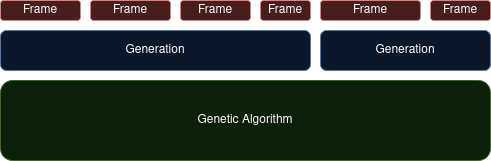

# Terrarium

A TypeScript/JavaScript framework that attempts to simplify the process of 
writing a genetic algorithm.

## Rationale

There are some things that are exactly the same between all (or most) genetic
algorithms (performing crossover when creating a new generation, selecting 
parents based on some metric for fitness, etc.). There are other things that are always
different between genetic algorithms (how fitness is calculated, the "form" of 
a member of the population).

My goal in writing this was to create a framework that takes, as input, all of 
the things that are unique to each implementation of a genetic algorithm and put
them together for the user so they don't have to worry about it.

**Don't get it twisted**. While this framework might make it easier to write a 
genetic algorithm, you'll probably struggle to use it if you don't already know
how they work.

## Intro

There are two main types that the framework defines:
* `GeneticAlgorithmModel`
* `GeneticAlgorithm`

`GeneticAlgorithmModel` is basically the "state" of your ecosystem at any given
moment. I think it can be thought of as the "model" of a program that implements
model-view-controller design (MVC).

`GeneticAlgorithm` is a wrapper around the model that might be thought of as the 
"controller" in MVC. It abstracts running the genetic algorithm behind a 
`play()` function. The genetic algorithm can be stopped at any point with the 
`pause()` function.

### Basic Usage:

1. Define the necessary functions:
    * stepFunction
    * crossover
    * createOrganism
    * mutate
    * shouldTerminate
    * calculateFitness
1. Pick out your hyperparameters:
    * populationSize
    * mutationRate
1. Create a `GeneticAlgorithm`.
    
        let geneticAlgorithm = new GeneticAlgorithm(
          createOrganism,
          stepFunction,
          calculateFitness,
          crossover,
          mutate,
          shouldTerminate,
          populationSize,
          mutationRate, 
        );

1. Start the genetic algorithm.

        geneticAlgorithm.play();

1. Optionally, read the model and display it however you like:

        while (true) {
          display(geneticAlgorithm.model);
        }

    > **Note**: you have to write the code for `display()`. This function can be
    thought of as the "view" in MVC.

## In-Depth Guide

### stepFunction()

The step function is the logic that is processed every single "frame" of the 
genetic algorithm's existence. What this represents conceptually can really vary
quite a bit. I think it depends on the complexity of your simulation. If you 
were simulating the stock market, this might represent what happens in a single 
day, but if you wanted a more complex simulation, this might represent what 
happens every hour or even minute. In some other even simpler genetic 
algorithms, this might represent an entire generation.

Take a look at this diagram:

> **Note**: notice that frames and generations can both vary in length.

This library assumes a **genetic algorithm** is composed of one or more 
**generations** and a single **generation** is composed of one or more 
**frames**.

So, there are three segments or levels to the whole progression of stuff. In 
other words, there are three types of "termination events":
1. end of a frame
1. end of a generation
1. end of a genetic algorithm

Number 1 is handled by `stepFunction()`.

Number 2 is handled by `shouldProgressGeneration()`.

Number 3 is handled by `shouldTerminate()`.

Also take note of the fact that `stepFunction()` may modify the population. 
While it's technically possible to do that in the other two functions, their 
naming suggests they perform only read operations to determine if their 
corresponding boolean values are true or false. 

There is a fundamental difference between number 1 and numbers 2 and 3 that 
should be understood. Basically, the framework already knows what's supposed to 
happen when a generation is over (produce offspring and apply mutation) and it
already knows what's supposed to happen when a generation is over (stop 
running). However, it doesn't know what's supposed to happen when a frame is 
over.

This is a design idea that's built into the implementation of this framework.
