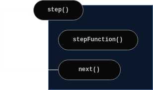

# Terrarium

A framework for building genetic algorithms.

## Design

I'm really interested in genetic algorithms. I think I like the idea of implementing some rules and then
just letting the program run. It's cool to watch the organisms learn new things and develop strategies.

One of my past projects was a genetic algorithm, but as I've progressed in my career, I've discovered
ways to improve upon that project's implementation.

I want to build a framework that I can use to implement new genetic algorithms easily.

Here's the design:

Basically, I wanted to standardize and abstract away the common parts of genetic algorithms.

The only things that change between genetic algorithms is the genes, how the genes are expressed, and
how fitness is calculated. These three thigns are the only things that the users of this framework
should have to implement themselves. I'd like to implement a few reproduction algorithms that they can 
choose from. That should include implementing automatic mutation based on the data type of each gene.

What parts must the user implement:
- gene definition (genome)
- gene expression (what happens during each "step")
- fitness algorithm

What parts are already implemented:
- evolution loop (the loop that executes a "step" for each loop)
- play, pause, stop, and restart functions
- metrics (per generation and all-time)

So, ideally, the user implements the gene definition, the "step" function, and the fitness algorithm.

Then, they just call something like `genetic_algorithm_framework.go()`. The framework automatically
runs the "step" function for each frame and then calculates the fitness at the end, performs reproduction,
and then starts a new generation.

---

Also, try to make it as compliant as possible with MVC.

## Limitations

This assumes reproduction happens at the same time for every organism. This is something that doesn't 
happen in real life. All members of each "generation" (baby boomers, millenials) are born at different
times. There is overlap between real-life generations. That isn't the case with genetic algorithms.

## The "step" function

This is the bulk of the genetic algorithm. It determines how genes are expressed. It determines how 
organisms interact with each other and the environment. This is the core of how the organisms will 
evolve. Obviously, this framework does not implement this function already, because it is unique to 
every genetic algorithm.

## Fitness function

The user must define this function as we cannot reasonably predict what the goal of the organisms
should be. I don't know how to require them to define this with certain parameters or return type.
Need to figure that out. This function should return a number that represents the fitness of a 
single organism.

Higher fitness = more fit parent.

## Crossover functions

These functions are **IN-PLACE**. They directly modify the object that is passed in and then return
nothing.

## Goal

Someone should be able to import this framework, create a set of genes, write the step function, and 
write the fitness function and then just let it run.

## Development Notes

Make sure we focus on MVC design.

Consider what changes between genetic algorithms (or use cases of this framework) and what doesn't 
change. Anything that changes should be a parameter to a constructor of the framework's `init` 
function or whatever I call it.

### Pause and Play functions

So ideally, there's just a single game loop that runs forever and either takes action or does not
based on the boolean value of some variable `isRunning`. However, how would I implement that? 
Would I have asynchronous functions running to modify some `state` object of the system while the
game loop is running? Maybe asynchronous functions are the way to go, but I'm not even sure that 
works. How are values handled in JavaScript? Can I even do something like that.

What if the caller just has a function that looks like the following?
```
function frame() {
  ...
  ecosystem.stepFunction()
  ...
  requestAnimationFrame(frame)
}
```

This would put the burden on the caller to run it in an infinite loop. I think this might be the 
best design I can think of right now. This makes all of the functions inside the ecosystem class 
self-contained. I like the idea of being able to kind of just throw around the `step()` function
wherever you feel like it and for it to not really cause any issues because it's all perfectly
self-contained and safe. And maybe it even operates on a semaphore, so that asynchronous calls 
are completely safe as well.

## Design Notes - 0ct 8

I think I've just finished converting the code to model-view-controller. I 
forget why I wanted to add these notes. I think I wanted to say that the library
should only handle the model. I think the library should handle updating the 
model and that's it (where "model" is the data representation of the genetic
algorithm). This enables that feature that Elliot mentioned all those years ago
where the users can speed up the algorithm instead of holding it at their 
browser's refresh rate.

I think clients should be responsible for displaying the model. I don't give a 
fuck man. No I do, but yeah I guess I think this library should just handle 
putting the model together and running it and abstracting away the complex parts
of a genetic algorithm (there aren't really any super complex parts but you 
know what I mean).

In other words, the client is responsible for the view and any 
controller-related stuff they want to implement. I want to make it trivial to 
change out the parts of the genetic algorithm and I think that's a reasonable 
goal for this project.

Optionally, I can release some sort of visualization library for the models? or 
maybe some sort of driver? I want to make it easy for people to display the 
state of the system at any point, but I think there's so much freedom that if I
were to implement a library that tried to make displaying the GA easier, I'd 
just be rewriting some 2d canvas graphics library that already exists. It's 
probably easier and better for everyone if I don't implement that and I let 
users decide how they want to do it.

However, it's certainly easier to debug this stuff with a visual output. So 
we'll see. I think that will probably mean I'll be very strongly encouraged to 
manage a view, which means I will do everything in my power to make it easier to 
do.

## Design Notes - Oct 14

I was about to write something in the usage guide about how it was hard to 
place the `mutationRate` variable. It applies to every single organism and with
most or maybe all genetic algorithms, it's the same across your entire 
population. Maybe it would actually be interesting to mess with this and have
each organism have a random mutation chance.

Anyways, I struggled to place this instance variable. One of the first
implementations of this had the `mutate` function take a single organism as its
only argument and it placed the `mutationRate` at the `GeneticAlgorithmModel` 
level. So when the `mutate` function was called (with only the organism in 
scope), it couldn't know the `mutationRate`.

So the decision was between passing the model to the `mutate` function and 
putting the `mutationRate` at the organism level. I decided on the second one 
for a couple reasons. I think it makes for a simpler implementation. It's easy
and very small-scoped for the user to write the logic to mutate only a single 
organism. That's the draw of this framework. You don't have to worry about 
putting everything together. You can just write each piece of code in its own 
little world and everything's very self contained from the user's point of view.
Additionally, the name `mutate` kind of suggests, to me, that it operates on a
single organism. Nature doesn't mutate an entire population at once, it 
mutates a single organism. Technically, it operates upon a single gene at a 
time, I guess. Maybe that's the "correct" way to implement this. I don't really
care. I'm pretty happy with the design I chose.

This design does however, mean a lot of duplicated information. I guess that's 
why my first instinct was to put this data at the model level: the information
is scoped to an entire model (usually). It's a marginal performance hit though.

## Design Notes - Oct 15

Ok I was just messing with the implementation and realized I'm not even calling
the fucking `stepFunction` anywhere. everything seemed to be working fine
because the word-guessing algorithm doesn't need a step function. Maybe that 
means it's not a great way to test the whole framework. Whatever. I'll deal with 
that later.

So now I'm trying to figure out where to put the actual step function. I think I
want the `next()` function to call it, but I want to diagram this out so that I
know what I'm actually doing.

Here's the diagram I came up with. I thought it would be harder. It's also 
kind of simplified (e.g. the `requestAnimationFrame` call isn't mentioned).



And then I implemented it by putting the `this.stepFunction` call right above 
the `this.next` function call.
